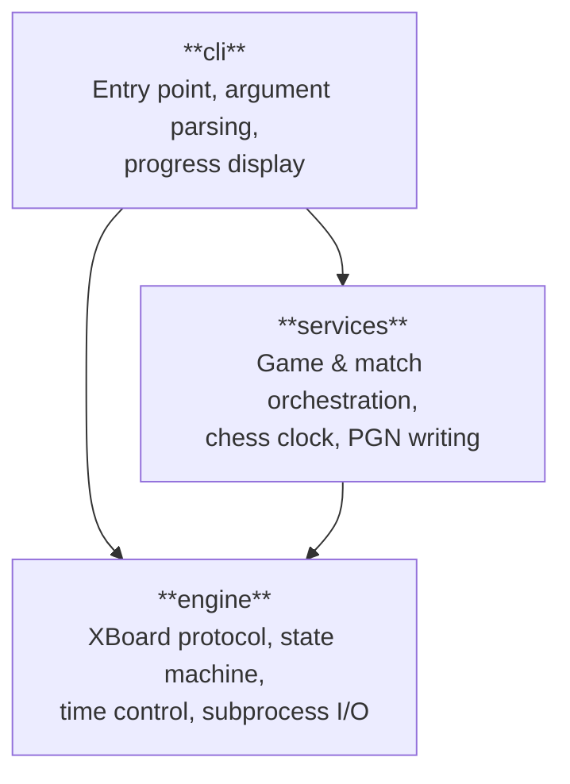
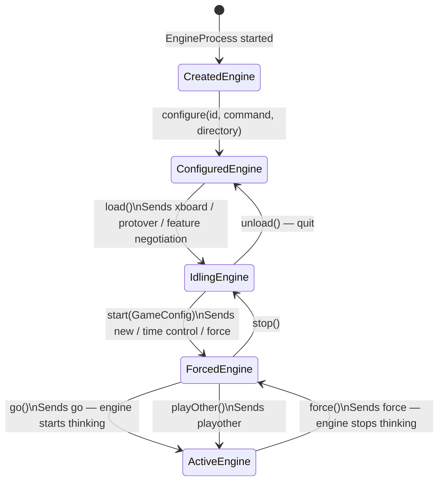
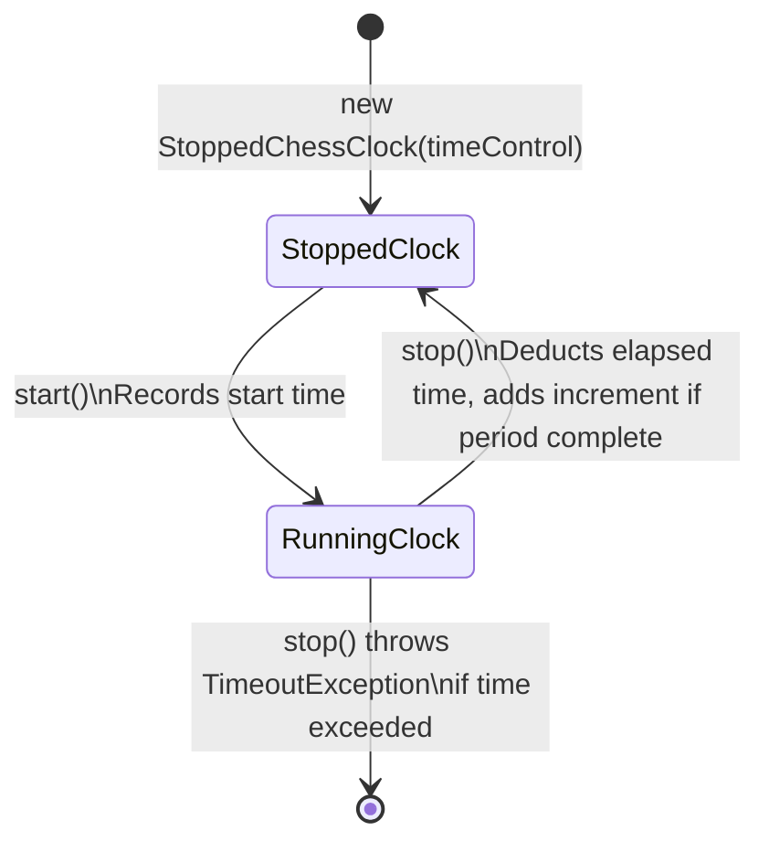
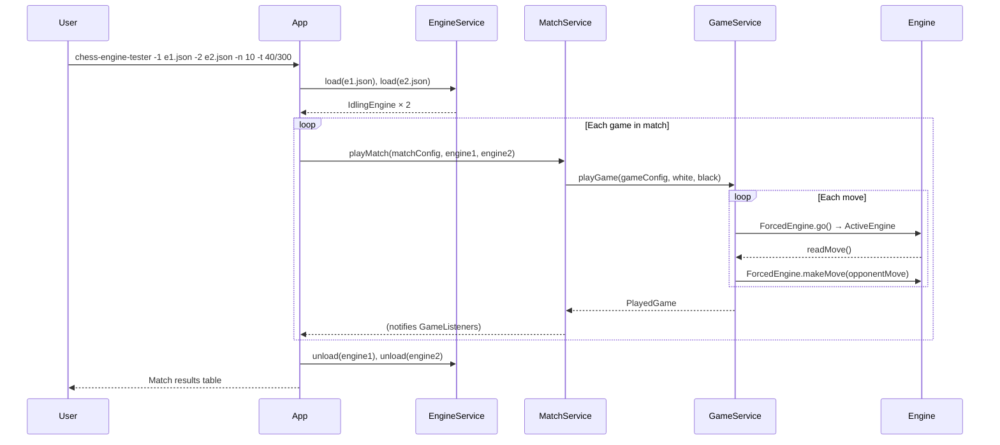

# Chess Engine Tester — Architecture Overview

Chess Engine Tester is a tool for running automated matches between chess engines that speak the [XBoard protocol](https://www.gnu.org/software/xboard/engine-intf.html). It handles time control, move validation, PGN output, and match statistics.

---

## Module Structure

The project is a multi-module Maven build with a strict layered dependency order. No module may depend on one above it.

| Module | Responsibility |
|--------|---------------|
| `engine` | State machine for engine lifecycle; XBoard protocol communication; time control definitions |
| `services` | Coordinating single games and multi-game matches; chess clock; PGN file output |
| `cli` | CLI argument parsing (Picocli); wiring all services together; displaying results |

**Key external libraries:** chesslib (move validation and board state), Picocli (CLI), Jackson (JSON config), JUnit 5 + Mockito (testing).

---

## Engine Lifecycle — State Machine

Each chess engine subprocess is managed through an explicit state machine. States are **immutable records**; every transition returns a new instance of the next state. This makes invalid operations a compile-time error rather than a runtime surprise.

### State responsibilities

- **`CreatedEngine`** — wraps a freshly started `EngineProcess`; no protocol handshake yet.
- **`ConfiguredEngine`** — knows which binary to run; can negotiate XBoard features via `load()`.
- **`IdlingEngine`** — fully initialised and idle; ready to start a game. Exposes `myName()`.
- **`ForcedEngine`** — inside a game but not thinking; used to feed opponent moves (`makeMove()`), send time updates (`postTime()`), and post results (`postResult()`).
- **`ActiveEngine`** — engine is thinking; exposes `readMove()` to wait for the engine's response.

---

## Chess Clock — State Machine

The clock is also modelled as two states to make elapsed-time accounting explicit and hard to misuse.

---

## Application Flow

---

## Key Abstractions

| Abstraction | Where | Purpose |
|-------------|-------|---------|
| `Engine` | `engine` | Base interface implemented by all state records |
| `EngineProcess` | `engine` | Isolates OS subprocess I/O; mocked in unit tests |
| `TimeControl` | `engine` | Sealed interface — `ClassicTimeControl` (moves/period) or `IncrementalTimeControl` (base + increment) |
| `ChessClock` | `services` | Two-state clock — `RunningChessClock` / `StoppedChessClock` |
| `GameListener` | `services` | Observer notified after each game; implemented by `ProgressBarWriter` and `PgnFileWriter` |
| `GameConfig` | `engine` | Record: white name, black name, `TimeControl` |
| `MatchConfig` | `services` | Record: number of games, `TimeControl` |
| `PlayedGame` | `services` | Result of one game including moves and termination reason |
| `PlayedMatch` | `services` | Aggregated match result across all games |

---

## Third-Engine Feature

Passing `-3 engine3.json` enables a *shadow* mode: a third engine receives every move played in the game and generates its own responses alongside the black engine, but those responses never affect the game outcome. This is useful for comparing engine behaviour or logging alternative lines without running a separate match.

---

## Testing Strategy

- **Unit tests** mock `EngineProcess` so no real chess engine binary is required.
- **Integration tests** (`*IT.java`) require GNU Chess and Ronja 0.9.0 placed in `./engines/`. They run during `mvn verify` via the Maven Failsafe plugin.
- **Docker** (`docker build .`) provides a self-contained environment for integration tests with no local engine dependencies.
